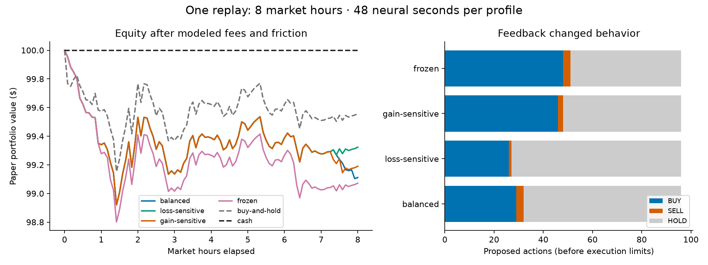

# Fly Trading Lab

An educational, paper-only experiment exploring how adjustable reinforcement changes a fruit-fly connectome simulation's trading behavior. **No profitable learning or biological replication has been demonstrated.**

This is an extension of [Stonkfly by Alex Wormuth / nftechie](https://github.com/nftechie/stonkfly), using the [MaleCNS v1.0 connectome](https://male-cns.janelia.org/). Stonkfly supplies the neural simulator, sensory interface and trading decoder. This fork adds adjustable feedback curves, chronological paper replay, identical-start comparisons, tests and reviewed results. The upstream MIT license is preserved; see [attribution](THIRD_PARTY.md).

## What happened?

Four profiles replayed the same eight hours of Bitcoin prices. Stronger-loss feedback changed 31/96 proposed actions compared with balanced feedback; stronger-gain feedback changed 44/96. The profiles remained dominated by buying and holding. All lost paper value after modeled costs.



**Eight market hours = 96 decisions = 48 seconds of simulated neural activity per profile.** Each decision advances the brain by 500 ms; the intervening five market minutes are not simulated continuously. This is one exploratory window, not an out-of-sample learning result. [Results and limitations](results/eight-hour-example/README.md).

For live prices with simulated trades and adjustable feedback, see the [live-paper guide](docs/LIVE-PAPER.md).

## Try it

From the repository root, with Python 3.11+ and a C++17 compiler (macOS/Linux; 16 GB RAM recommended):

```sh
python3 -m venv .venv
source .venv/bin/activate
pip install -e '.[test]'
python -m stonkfly prepare
python -m stonkfly.lab fixture --out runs/toy.csv
python -m stonkfly.lab run --prices runs/toy.csv --out runs/toy-example --steps 6
```

Preparation downloads about 1.1 GB and verifies the complete retained graph: 166,700 neurons and 25,582,938 directed connections. Allow several GB of disk space. Profiles run sequentially; full-brain execution takes minutes to tens of minutes depending on the experiment and hardware.

The `stonkfly.lab` / `fly-lab` entry point has **no live-trading option** and requires no exchange credentials. Upstream live-trading modules remain in the fork for provenance, but are not used by the lab. [Operator guide](docs/LEARNING-LAB.md) · [Reproduce the published run](docs/REPRODUCING.md) · [Model assumptions](docs/model.md) · [Future validation](docs/VALIDATION-PLAN.md).

```sh
python -m pytest -q
```
