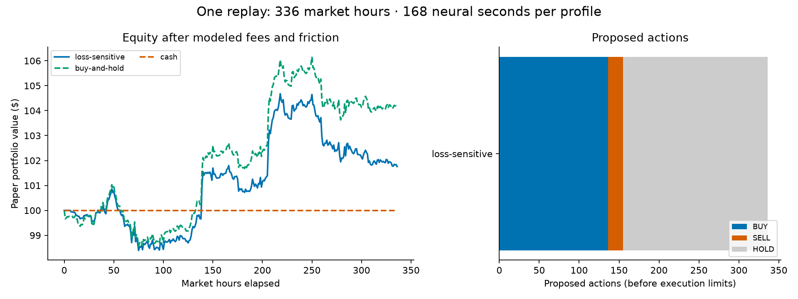

# Two-week hourly Bitcoin replay

Window: 2026-09-12T19:00:00+00:00 to 2026-09-26T19:00:00+00:00.

Loss-sensitive profile; 336 hourly decisions; 168 simulated neural seconds. Initial paper capital $100; maximum exposure 50%; maximum order $10; fee 0.6%; adverse fill friction 0.05%. Completed candles only; fill at next open and mark at its close.

| Portfolio | Final equity | Return | Max drawdown | Fees | Trades |
|---|---:|---:|---:|---:|---:|
| loss-sensitive | $101.7579 | 1.758% | 2.790% | $2.4402 | 65 |
| buy-and-hold | $104.1141 | 4.114% | 2.450% | $0.2992 | 1 |
| cash | $100.0000 | 0.000% | 0.000% | $0.0000 | 0 |



## Behavior

Proposed actions: **136 BUY, 19 SELL and 181 HOLD**.
Executed trades: **47 buys and 18 sells**. Execution limits rejected 90 proposals; the other 181 decisions were HOLDs.
Feedback at its current cap: 113/336 observations.
Final changed connections: 3579.

| Day | BUY | SELL | HOLD | Executed trades | End equity |
|---|---:|---:|---:|---:|---:|
| 1 | 4 | 2 | 18 | 5 | $99.7699 |
| 2 | 3 | 0 | 21 | 2 | $100.8658 |
| 3 | 4 | 0 | 20 | 2 | $98.7476 |
| 4 | 8 | 1 | 15 | 4 | $98.4084 |
| 5 | 6 | 1 | 17 | 3 | $98.8615 |
| 6 | 13 | 2 | 9 | 3 | $101.4841 |
| 7 | 12 | 2 | 10 | 5 | $101.5287 |
| 8 | 9 | 2 | 13 | 8 | $100.9647 |
| 9 | 10 | 0 | 14 | 1 | $104.1120 |
| 10 | 12 | 0 | 12 | 0 | $104.3598 |
| 11 | 13 | 3 | 8 | 11 | $102.6941 |
| 12 | 15 | 2 | 7 | 6 | $102.5759 |
| 13 | 17 | 2 | 5 | 11 | $101.9503 |
| 14 | 10 | 2 | 12 | 4 | $101.7579 |

## Interpretation limits

This single fixed-start window overlaps the earlier eight-hour experiment. It is not an independent held-out evaluation. Changing to hourly candles changes the chart history span and the scale of portfolio changes reaching the unchanged reward curve, in addition to reducing the decision frequency. It does not isolate the causal effect of decision frequency.

Buy-and-hold invests up to the 50% cap immediately, while the neural strategy is subject to a $10 order cap. Their exposure paths differ. Cash does not incur trading costs. Final equity marks remaining Bitcoin without terminal liquidation fees. No real exchange orders were submitted. Weight changes, spike changes and returns alone do not establish useful learning.

## Reproduce this exact window

Install the project and prepare the connectome as described in the root README, then run from the repository root:

```sh
python -m stonkfly.lab run --prices results/two-week-hourly/prices.csv --profiles results/two-week-hourly/profiles.json --warmup 100 --steps 336 --neural-ms 500 --fee 0.006 --friction 0.0005 --order 10 --max-exposure 0.5 --out runs/two-week-reproduction
```

Use a new output directory. The original run took about 25 minutes on the local machine; runtime varies with hardware. Chart warmup is price history, not neural training. The 437 input candles include 101 context/decision candles before the first filled hour, followed by the 336 measured hours. Timestamps in the measurements name the filled candle's start; its equity is valued at that candle's close.

The manifest records the market checksum, original simulator source hashes and experiment commit. The exact experimental source is preserved at that commit; dependency, compiler and platform differences can affect numerical reproducibility. The curve uses gain 1, loss 2 and loss exponent 1.5, with the other defaults recorded in the implementation.

Public Coinbase Exchange BTC-USD candles were fetched in two requests; the URLs and retrieval timestamp are in [source metadata](prices.source.json). The downloader verified a complete hourly sequence and excluded the unfinished hour. The reviewed bundle contains numeric market data and selected simulated measurements; no account data, credentials, raw runtime logs, checkpoints or connectome files are included.

The chart can be regenerated with `python experiments/plot_results.py results/two-week-hourly` after installing the `report` extra. [Earlier eight-hour comparison](../eight-hour-example/README.md) · [Future validation](../../docs/VALIDATION-PLAN.md) · [Attribution](../../THIRD_PARTY.md).
